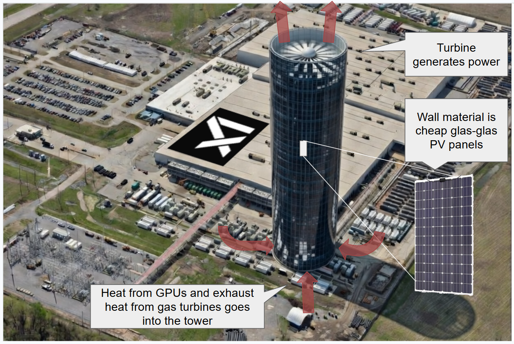

# dccupdraft
Datacenter passive cooling with updraft and PV power generation

# Thermal Updraft Tower System - 1 GW AI Data Center
## Optimized Multi-Tower Configuration with Solar Collector Skirt

### 1. Reference Scenario

| Parameter | Value |
|---|---|
| Data center IT load | 1,000 MW (1 GW) |
| PUE | 1.3 |
| Total DC electrical demand | 1,300 MW |
| Gas turbine efficiency | 38% |
| Gas turbine fuel input | 3,421 MW thermal |
| GT exhaust heat | 2,121 MW @ 450-550 C |
| DC waste heat (servers) | 1,000 MW @ 35-50 C |
| **Total thermal to tower system** | **3,121 MW** |

---

### 2. Key Physics Constraint

The glass-glass PV hull limits the interior air temperature rise to **dT <= 50 K**. This constrains the minimum number of towers:

    Q_per_tower = rho * A * c_p * dT^1.5 * sqrt(2*g*H/T_amb)

At dT = 50 K and H = 200m, one tower can handle ~446 MW thermal.
For 3,121 MW total: **minimum ~7 towers at 175m**, or **~5 towers at 450m**.

---

### 3. Optimization Results

The optimizer searched 1,586 feasible configurations across:
- Tower heights: 150-500m (25m steps)
- Tower count: 3-20
- Solar collector radius: 0-300m

#### 3.1 Recommended Configuration (Best Payback)

| Parameter | Value |
|---|---|
| **Number of towers** | **7** |
| **Tower height** | **175m** |
| Tower diameter | 20m |
| Interior dT | 49.1 K |
| Updraft velocity | 24.0 m/s (86 km/h) |
| Mass flow per tower | 7,744 kg/s |

#### 3.2 Energy Output

| Source | Output |
|---|---|
| Turbine power (all 7 towers) | 14.6 MW continuous |
| Annual turbine generation | 127,517 MWh/yr |
| PV generation (all towers) | 13,488 MWh/yr |
| **Total generation** | **141,005 MWh/yr** |

#### 3.3 Cost Summary

| Item | Value |
|---|---|
| CAPEX per tower | $29.7 M |
| **Total CAPEX** | **$207.6 M** |
| Annual OPEX | $3.5 M |
| Energy revenue (@$80/MWh) | $11.3 M/yr |
| Cooling credit | $140.2 M/yr |
| **Payback (incl. cooling credit)** | **1.4 years** |
| LCOE (energy only) | $143/MWh |

---

### 4. The Dominant Value: Cooling Offset

The most striking finding is that **energy generation is secondary**. The primary value is **passive waste heat extraction**.

The 7 towers collectively create a continuous updraft pulling 54,208 kg/s of air through the system. This extracts the full 1,000 MW of DC waste heat without mechanical chillers. At a chiller COP of 5, this offsets **200 MW of cooling electricity**, worth **$140M/yr**.

This reframes the tower system from "inefficient power plant" to "zero-electricity cooling system that also generates power."

| Value stream | Annual value | % of total |
|---|---|---|
| Cooling offset (200 MW saved) | $140.2 M | 92.5% |
| Turbine electricity | $10.2 M | 6.7% |
| PV electricity | $1.1 M | 0.7% |
| **Total** | **$151.4 M** | **100%** |

---

### 5. Solar Collector Skirt Analysis

A ground-level transparent collector (greenhouse) heats ambient air before it enters the tower base.

**Finding: The skirt provides marginal benefit at the optimal configuration.**

At 7 towers x 175m, the system already operates near the dT = 50 K limit. Adding solar heat via the skirt pushes it past the thermal constraint at R > 200m.

| Skirt Radius | Additional Heat | Impact |
|---|---|---|
| 0m (none) | 0 MW | Baseline, dT = 49.1 K |
| 100m | 21.5 MW (+0.7%) | Marginal, dT = 49.3 K |
| 200m | 87.5 MW (+2.8%) | At limit, dT = 50.0 K |
| 250m+ | -- | **Infeasible** (dT > 50 K) |

**The skirt becomes valuable only with more/taller towers** that have thermal headroom. For example, 10 towers x 300m with R = 300m skirts adds 490 MW solar thermal and 110,000 m^2 of collector per tower, but at much higher CAPEX.

**Recommendation:** Omit the skirt in the base configuration. Add it as a Phase 2 upgrade if additional towers are built (e.g., during DC expansion from 1 GW to 2 GW).

---

### 6. Height Sensitivity

With N = 7 towers (no skirt):

| Height (m) | Turbine (MW) | Total (MWh/yr) | CAPEX ($M) | Payback (yr) | LCOE ($/MWh) |
|---|---|---|---|---|---|
| 175 | 14.6 | 141,005 | 207.6 | 1.4 | 143 |
| 200 | 16.6 | 161,149 | 231.0 | 1.5 | 137 |
| 300 | 25.0 | 241,723 | 333.0 | 2.1 | 126 |
| 400 | 33.3 | 322,298 | 446.0 | 2.7 | 122 |
| 500 | 41.6 | 402,872 | 567.8 | 3.4 | 122 |

Diminishing returns above 400m. LCOE flattens at ~$122/MWh. Payback is shortest at minimum feasible height (175m) because the cooling credit dominates and tower cost increases faster than energy output.

---

### 7. Alternative: Fewer Tall Towers

| Config | Towers | Height | CAPEX | Turbine MW | LCOE | Payback |
|---|---|---|---|---|---|---|
| Minimum cost | 7 | 175m | $208M | 14.6 | $143 | 1.4 yr |
| Best LCOE | 5 | 450m | $361M | 37.4 | $90 | 2.2 yr |
| Max output | 20 | 500m | $1,989M | 49.1 | $315 | 11.5 yr |

**The 5 x 450m configuration** offers the best LCOE at $90/MWh with 37 MW of turbine output. It costs $361M but generates 352,676 MWh/yr. However, building 450m towers is a major engineering challenge (taller than most skyscrapers).

**The 7 x 175m configuration** minimizes CAPEX and payback. 175m is a conventional industrial chimney height, reducing engineering risk.

---

### 8. Comparison with Conventional Alternatives

For the same $208M CAPEX:

| Technology | Capacity | Annual Output | Notes |
|---|---|---|---|
| Ground-mount solar PV | 208 MW | 311,000 MWh | Proven, but doesn't cool DC |
| Onshore wind | 160 MW | 511,000 MWh | Proven, but doesn't cool DC |
| ORC waste heat recovery | 59 MW | 445,000 MWh | Higher output, needs cooling water |
| **Updraft towers (7x175m)** | **14.6 MW** | **141,000 MWh** | **+ 200 MW cooling offset** |

The towers generate less electricity per dollar, but the **200 MW cooling offset** is worth $140M/yr -- a benefit no alternative provides. In effect, the towers replace a $200M+ mechanical cooling plant while also generating power.

---

### 9. Engineering Considerations at 1 GW Scale

#### 9.1 Layout
- 7 towers spaced ~200m apart (center-to-center)
- Total campus footprint for towers: ~500m x 300m
- Data center halls arranged radially around tower bases for shortest duct runs
- GT exhaust manifolded to all 7 towers via insulated steel ducts

#### 9.2 Structural
- 175m concrete or steel chimney is well within industrial practice (power plant stacks routinely reach 200-300m)
- PV cladding adds ~267 tons per tower (manageable)
- 7 identical towers allow standardized design and serial construction

#### 9.3 Cooling Integration
- Server exhaust air (35-50 C) ducted directly to tower base mixing chamber
- GT exhaust (450-550 C) introduced through separate high-temperature inlet with refractory lining in lower 20m
- Natural draft eliminates all fan power for primary cooling path
- Backup mechanical cooling required for tower maintenance outages

#### 9.4 Regulatory
- FAA obstruction lighting required (>61m)
- 175m height avoids most aviation conflicts (below typical approach surfaces)
- Thermal plume modeling required for environmental assessment
- Multiple towers may require cumulative impact study

---

### 10. Phased Deployment Strategy

| Phase | Scope | CAPEX | Benefit |
|---|---|---|---|
| Phase 1 | 3 towers x 175m, 400 MW DC | $89M | Prove concept, cool initial capacity |
| Phase 2 | +4 towers, scale to 1 GW DC | $119M | Full cooling, 14.6 MW generation |
| Phase 3 | Extend towers to 300m, add skirts | $150M | 25 MW generation, solar contribution |

---

### 11. Conclusion

For a 1 GW AI data center, the optimal updraft tower configuration is **7 towers at 175m height** (minimum CAPEX, fastest payback) or **5 towers at 450m** (best energy economics).

The critical insight: these towers should be evaluated primarily as a **passive cooling system**, not a power plant. The 200 MW cooling offset ($140M/yr value) dwarfs the 14.6 MW electricity generation ($11M/yr). The LCOE of the generated electricity is high ($90-143/MWh), but when the cooling credit is included, the system pays for itself in **1.4-2.2 years**.

The solar collector skirt adds marginal value at the optimal configuration because the system already operates near its thermal limit. It becomes relevant only if additional towers or taller towers provide thermal headroom.

---

*Analysis prepared March 2026. Costs in 2026 USD. AACE Class 5 estimates (+50%/-30%).*
*Cooling credit assumes full DC waste heat extraction via tower draft; actual capture rate depends on duct design and may be 60-90%.*
